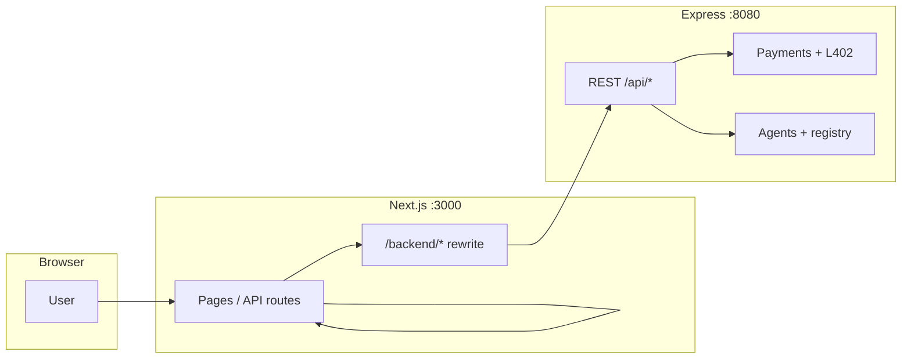

# ShotenX AI (monorepo)

Lightning-native **agent marketplace MVP**: **Next.js** frontend in `frontend/` and **Express** API in `backend/`. Same-origin UI with **`/backend/*`** proxy, L402 / invoices, builder + Agentverse flows.

---

## Layout

```text
./
  Dockerfile          optional root image (Next frontend) for hosts that only detect ./Dockerfile
  frontend/           Next.js 16 app + canonical frontend/Dockerfile
  backend/            Express API + backend/Dockerfile
  docker-compose.yml
  render.yaml         Render Blueprint (rootDir per service — preferred over root Dockerfile alone)
```

---

## Architecture



---

## Local Development

### Backend

```bash
cd backend
cp .env.example .env
npm ci && npm run dev
```

### Frontend

```bash
cd frontend
cp .env.example .env   # NEXT_PUBLIC_BACKEND_URL=http://localhost:8080
npm ci && npm run dev
```

---

## Docker Compose (full stack)

From **repository root**:

```bash
docker compose up --build
```

| Service      | URL                    |
|--------------|------------------------|
| **Frontend** | http://localhost:3000  |
| **Backend**  | http://localhost:8080  |

**Persistence:** volume `shotenx_backend_data` → backend `/app/data`

Compose loads **one root `.env`** into **both** containers (`env_file: .env`). Copy **`cp .env.example .env`** and fill values. Compose overrides **`NEXT_PUBLIC_BACKEND_URL`** to `http://backend:8080` for the frontend container so Next can reach Express on the Docker network.

> **uAgent (Fetch)** — Docker images include Python + `uagents` / `uagents-core` / `requests` per the [Node.js Client Integration](https://innovationlab.fetch.ai/resources/docs/examples/integrations/nodejs-client-integration) guide. Optional host ports **8000** (frontend bridge) and **8001** → backend bridge.

---

## Environment Variables

| Location | Purpose |
|----------|---------|
| **`.env` (repo root)** | **Docker Compose + recommended single file** — merged frontend + backend keys; see **`.env.example`** |
| `frontend/.env` | Optional: only if you run `npm run dev` inside `frontend/` without using root `.env` |
| `backend/.env` | Optional: only for `cd backend && npm run dev` alone; Compose does **not** read it by default |

---

## Render

Root **`render.yaml`** defines two Docker Web Services (`rootDir: backend` / `rootDir: frontend`). After first deploy, set real URLs:

- **`NEXT_PUBLIC_BACKEND_URL`** on the frontend service
- **`ALLOWED_ORIGINS`** on the backend to your frontend URL

Optional **GitHub Actions** `/.github/workflows/deploy-render.yml`: add **`RENDER_DEPLOY_HOOK_URL`** (and a second workflow or secret if you use separate hooks per service).

---

## CI (GitHub Actions)

| Workflow | When |
|----------|------|
| `ci.yml` | Push / PR — jobs **frontend** and **backend** (typecheck + build) |
| `deploy-render.yml` | Manual; optional deploy hook POST |

---

## Scripts

| Command | Where |
|---------|--------|
| `npm run dev` / `build` / `start` | `frontend/` |
| `npm run dev` / `build` / `start` | `backend/` (`node dist/index.js`) |

---

## New Private GitHub Repository (monorepo)

**GitHub UI:** New repository → name e.g. `shotenx-ai` → **Private** → create **without** README, then:

```bash
cd /path/to/this-monorepo
git remote rename origin old-origin   # optional, if you already had origin
git remote add origin git@github.com:YOUR_USER/shotenx-ai.git
git push -u origin main
```

Or with [GitHub CLI](https://cli.github.com/) after `gh auth login`:

```bash
gh repo create YOUR_USER/shotenx-ai --private --source=. --remote=origin --push
```

---

## License

Private / team use unless stated otherwise.