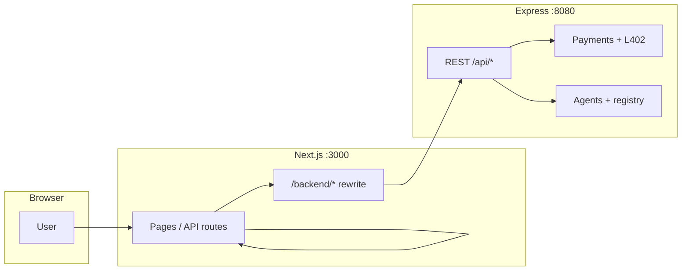
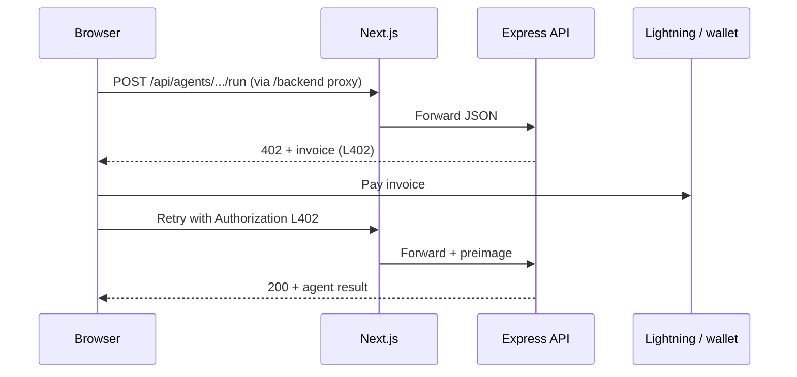

# ShotenX AI

Lightning-native **agent marketplace MVP**: browse agents, pay with **L402 / invoices**, run **builder** and **Agentverse** flows from **Next.js** (`ShotenX_AI`) and **Express** (`shotenx_ai_backend`).

---

## Architecture



- **Browser** talks only to **Next** (same origin).  
- **`/backend/*`** is proxied **server-side** to the API base URL (`NEXT_PUBLIC_BACKEND_URL`).  
- **Premium Agentverse** path: Next `/api/premium/agent-query` → after pay → backend `/api/agents/direct-chat`.

---

## Request flow (paid builder run)



---

## Repositories

| Repo | Role |
|------|------|
| **ShotenX_AI** (this repo) | Next.js 16 UI, API routes, Supabase auth, Bitcoin Connect |
| **shotenx_ai_backend** (sibling) | Express, agents registry, payments, ASI1 / OpenAI builders |

Clone both next to each other for Docker Compose paths to work out of the box.

---

## Environment variables

### Frontend (`ShotenX_AI/.env`)

| Variable | Required | Purpose |
|----------|----------|---------|
| `NEXT_PUBLIC_BACKEND_URL` | Yes | Express base URL (browser uses `/backend/*` rewrite from Next). |
| `NEXT_PUBLIC_SUPABASE_URL` | For auth | Supabase project URL. |
| `NEXT_PUBLIC_SUPABASE_ANON_KEY` | For auth | Supabase anon key. |

Optional (see `.env.example`): ASI1 keys on **server** routes, Alby / L402 secrets, Agentverse token, internal relay secret.

### Backend (`shotenx_ai_backend/.env`)

| Variable | Required | Purpose |
|----------|----------|---------|
| `PORT` | No (default 8080) | Listen port. |
| `ALLOWED_ORIGINS` | Yes in prod | CSV of browser origins for CORS. |
| `AGENTVERSE_API_KEY` | For Agentverse | Search + direct chat. |
| `ASI_ONE_API_KEY` | For ASI1 builders | Chat + image preset agents. |

See each repo’s **`.env.example`** for the full optional set (OpenAI, image models, rate limits, etc.).

---

## Local development

**Backend**

```bash
cd shotenx_ai_backend
cp .env.example .env   # fill values
npm ci && npm run dev
```

**Frontend**

```bash
cd ShotenX_AI
cp .env.example .env   # set NEXT_PUBLIC_BACKEND_URL=http://localhost:8080
npm ci && npm run dev
```

---

## Docker Compose (full stack)

Layout:

```text
parent/
  ShotenX_AI/          ← this repo (compose file lives here)
  shotenx_ai_backend/
```

From **ShotenX_AI**:

```bash
export BACKEND_CONTEXT=../shotenx_ai_backend   # default if repos are siblings
docker compose up --build
```

- **Frontend**: http://localhost:3000  
- **Backend**: http://localhost:8080  
- **Persistence**: named volume `shotenx_backend_data` → `/app/data` (payments / ratings files).

**uAgent client (Fetch)** — Both Docker images install **Python 3**, **`uagents`**, **`uagents-core`**, and **`requests`**, matching the [Node.js Client Integration](https://innovationlab.fetch.ai/resources/docs/examples/integrations/nodejs-client-integration) guide. The frontend image starts **`bridge_agent.py`** in the background when present, then **`node server.js`** (standalone). Compose maps **host `8000` → frontend bridge** and **`8001` → backend bridge** (container port `8000`) for local debugging; omit those port lines if you do not need them.

Override backend path:

```bash
BACKEND_CONTEXT=/abs/path/to/shotenx_ai_backend docker compose up --build
```

---

## Railway

Recommended: **two Railway services** (one from each GitHub repo), or **one monorepo** with two services.

1. **Backend service** — root `shotenx_ai_backend`, Dockerfile `Dockerfile`, start `node dist/index.js`, set `PORT` + `ALLOWED_ORIGINS` (your `https://<frontend>.up.railway.app`).  
2. **Frontend service** — root `ShotenX_AI`, Dockerfile `Dockerfile`, build arg / env **`NEXT_PUBLIC_BACKEND_URL=https://<backend>.up.railway.app`**.

Railway can deploy from GitHub without Actions; optional **GitHub Actions** workflows:

- `/.github/workflows/ci.yml` — lint + build on every PR.  
- `/.github/workflows/deploy-railway.yml` — **manual** `workflow_dispatch` + `RAILWAY_TOKEN`; if the Railway project has **multiple services**, also set secret **`RAILWAY_SERVICE`** (exact service name) or fill the **service** workflow input when running the action.

Add the same pattern in the backend repo for its own CI.

---

## CI (GitHub Actions)

| Workflow | When |
|----------|------|
| `ci.yml` | Push / PR to `main` or `master` |

Frontend CI sets placeholder Supabase env vars so `next build` can prerender. Replace with real project values for production builds if needed.

---

## Scripts

| Command | Where |
|---------|--------|
| `npm run dev` | Both |
| `npm run build` / `npm start` | Frontend |
| `npm run build` / `npm start` | Backend (`node dist/index.js`) |

---

## License

Private / team use unless stated otherwise.
