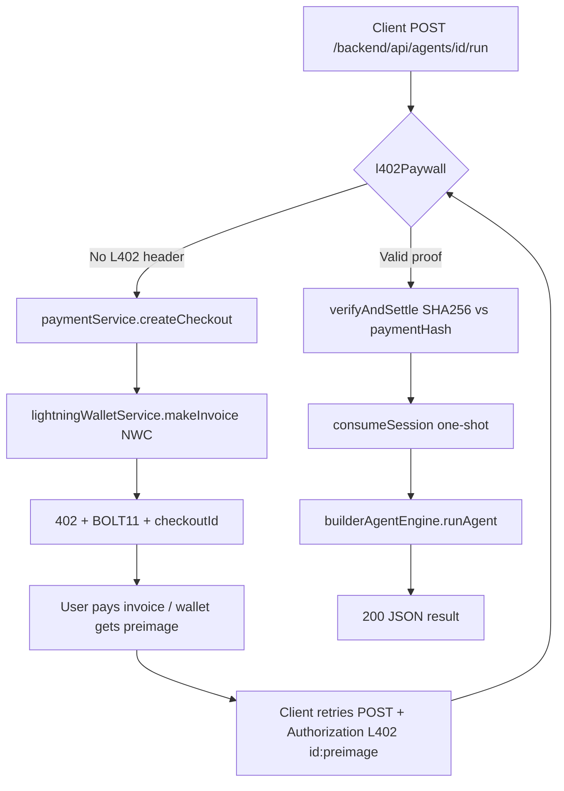
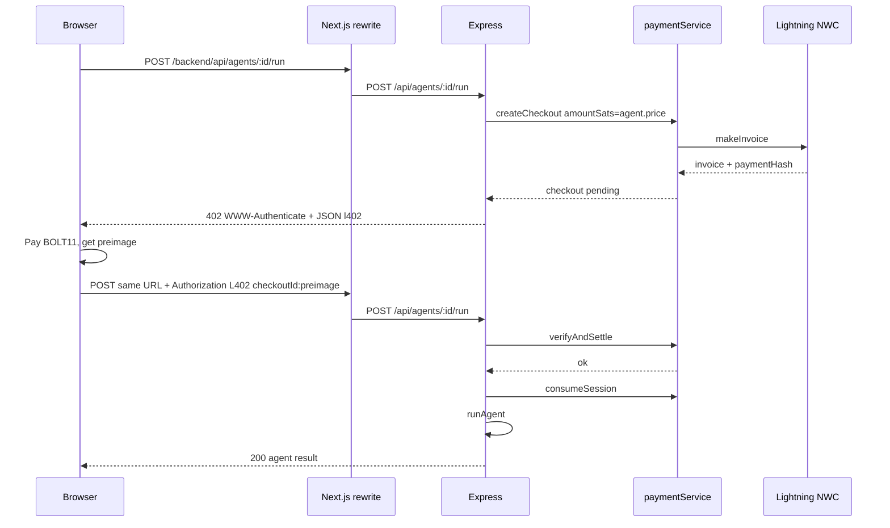
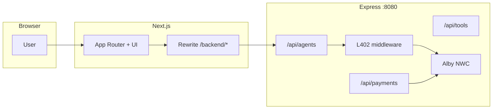
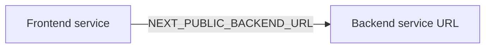

# ShotenX AI

**Lightning-native agent marketplace MVP** — discover agents, run them behind **HTTP 402 (L402)** + **BOLT11 invoices**, and pay **per run in sats** instead of bundling everything into subscriptions.

**Repository:** [https://github.com/gautammanak1/shotenx-ai](https://github.com/gautammanak1/shotenx-ai)

---

## Table of contents

1. [What problem we solve](#what-problem-we-solve)  
2. [How ShotenX solves it](#how-shotenx-solves-it)  
3. [How an agent gets paid (technical workflow)](#how-an-agent-gets-paid-technical-workflow)  
4. [Architecture](#architecture)  
5. [Repository layout](#repository-layout)  
6. [Local development](#local-development)  
7. [Docker Compose](#docker-compose-full-stack)  
8. [Environment variables](#environment-variables)  
9. [Deploying to Render](#deploying-to-render)  
10. [CI](#ci-github-actions)  
11. [Scripts](#scripts)  
12. [Video / demo outline](#video--demo-outline)  
13. [License](#license)

---

## What problem we solve

| Problem | Why it hurts builders & users |
|--------|--------------------------------|
| **Subscription walls** | Users pay monthly even for a few agent calls; hard to align cost with value. |
| **Opaque API pricing** | “Enterprise pricing” or hidden limits make it hard to ship demos that feel real. |
| **No payment primitive on HTTP** | Classic APIs return 200 or 401; there is no standard way to say **“pay this invoice, then retry.”** |
| **CORS + split origins** | Putting UI on one host and API on another complicates cookies, env, and mobile flows. |
| **Trust at execution time** | You want **proof of payment** tied to a **single** execution, not a long-lived session that can be replayed forever. |

ShotenX focuses on a **narrow product slice**: marketplace discovery, **L402-gated** runs, builder registry, and optional **Bitcoin Connect / Alby** on the client — with a **monorepo** that is **Docker- and Render-friendly**.

---

## How ShotenX solves it

1. **Per-run pricing** — Each builder agent carries a **price in sats**; paid routes use that amount (or fixed amounts for tool routes).  
2. **L402 as the gate** — First request without payment gets **HTTP 402** + a **Lightning invoice** (`paymentRequest`) and metadata (`checkoutId`, `paymentHash`). After the user pays, the client **retries the same request** with proof in `Authorization: L402 <checkoutId>:<preimage>`.  
3. **Cryptographic settlement** — The backend checks **SHA256(preimage)** against the invoice **payment hash** (BOLT11 semantics), then marks the checkout **settled** and **consumed** so the proof is **single-use** (replay protection).  
4. **Same-origin UI** — The browser calls **`/backend/api/...`** on the Next app; **`next.config.mjs`** rewrites to the Express **`NEXT_PUBLIC_BACKEND_URL`**, so you avoid exposing a second public origin for simple deployments.  
5. **Real or test rails** — With **`ALBY_NWC_URL`**, invoices are created via **Nostr Wallet Connect**; without it, flows that need a wallet fail unless you use test / degraded paths documented in code.

---

## How an agent gets paid (technical workflow)

This is the **end-to-end path** for a **builder agent** (registered in the backend registry with a `price` in sats). Agentverse search agents follow different paths; **paid execution** for registered builders is centered on **`POST /api/agents/:agentId/run`**.

### Step 1 — Route mounts the paywall before the handler

Express mounts agent routes under `/api/agents` (`backend/src/index.ts`):

```typescript
app.use("/api/agents", agentRoutes);
```

The **run** route injects the agent’s price into the body, then runs **`l402Paywall`** **before** the handler that actually executes the agent (`backend/src/routes/agentRoutes.ts`):

```typescript
agentRoutes.post("/:agentId/run", builderRunRateLimit, async (req, res, next) => {
  const agent = builderAgentEngine.getAgent(req.params.agentId);
  if (!agent) {
    return res.status(404).json({ error: "Agent not found" });
  }
  req.body = {
    ...req.body,
    amountSats: agent.price,
    agentId: agent.id,
    buyerId: req.body?.buyerId ?? "anonymous-user"
  };
  return l402Paywall(req, res, next);
}, async (req, res) => {
  // … after paywall: parse body, builderAgentEngine.runAgent(…), return JSON
});
```

So **the agent’s fee** is always **`agent.price`** for that route instance.

### Step 2 — No payment header → create checkout + return 402

`l402Paywall` (`backend/src/middleware/l402Paywall.ts`) does roughly:

1. Parse `Authorization: L402 <checkoutId>:<preimage>` if present.  
2. If missing (and no valid settled token), call **`paymentService.createCheckout`** with `amountSats`, `agentId`, `buyerId`, and the request path/method.  
3. **`lightningWalletService.createInvoice`** (Alby NWC when configured) returns **BOLT11** + **payment hash**.  
4. Respond with **402** + JSON body describing the challenge + **`WWW-Authenticate`** header.

Conceptually:

```typescript
const checkout = await paymentService.createCheckout({
  agentId: req.body?.agentId ?? "generic-premium-tool",
  buyerId: req.body?.buyerId ?? "anonymous-agent",
  amountSats: Number(req.body?.amountSats ?? defaultPrice),
  requestPath: req.originalUrl,
  requestMethod: req.method
});
// … build challenge with checkout.id, invoice, paymentHash, verifyEndpoint …
res.setHeader(
  "WWW-Authenticate",
  `L402 token="${checkout.id}", invoice="${checkout.invoice}", amount=${checkout.amountSats}`
);
return res.status(402).json(challenge);
```

The client (or a wallet library) **pays the invoice**; from the payment result you obtain the **preimage** (secret) that matches the invoice’s **payment hash**.

### Step 3 — Retry with L402 proof → verify → consume → run agent

On the retry, the middleware parses the header:

```typescript
// Authorization: L402 <checkoutId>:<preimage>
const verified = await paymentService.verifyAndSettle({
  checkoutId,
  preimage: parsedAuth.preimage,
  requestPath: req.originalUrl,
  requestMethod: req.method
});
if (verified.ok) {
  paymentService.consumeSession(checkoutId, req.originalUrl, req.method);
  return next(); // → Express runs the next handler: actually runs the agent
}
```

Inside **`paymentService.verifyAndSettle`** (`backend/src/services/paymentService.ts`), the critical check is:

- Compute **`SHA256(preimage)`** (hex) and compare to the session’s **`paymentHash`** from the invoice.  
- If it matches, mark session **settled**, then **`consumeSession`** marks it **consumed** so the same proof cannot unlock another run.

So **money flow** is: **invoice created → user pays Lightning → preimage proves payment → one agent run allowed**.

### Step 4 — How the frontend reaches that API

Browser code does **not** hardcode the Express host. It calls **same-origin** paths prefixed with **`/backend`**, and Next rewrites them (`frontend/next.config.mjs`):

```javascript
{
  source: "/backend/:path*",
  destination: `${process.env.NEXT_PUBLIC_BACKEND_URL ?? "http://127.0.0.1:8080"}/:path*`,
}
```

The client helper (`frontend/lib/api.ts`) builds URLs like **`/backend/api/agents/...`**. So a paid run is conceptually:

```http
POST /backend/api/agents/<agentId>/run
Content-Type: application/json
{ "input": "…", "buyerId": "…" }

→ 402 + invoice first time
→ POST again with:
Authorization: L402 <checkoutId>:<preimage>
```

### Step 5 — Fixed-price “tools” (same L402 machinery)

Paid HTTP tools under **`/api/tools/*`** use **`l402PaywallFor(n)`** to set a **fixed** `amountSats` before the same `l402Paywall` (`backend/src/routes/toolRoutes.ts`). Same pay → prove → execute pattern.

### Workflow diagram (paid builder run)



### Sequence diagram (optional detail)



---

## Architecture

### Stack overview



### Render: use two Web Services when hosting separately



If you deploy **only** the repo-root **`Dockerfile`**, you get **Next only** — there is **no** Express API on that host. Use **`render.yaml`** (Blueprint) or create **two** services: **frontend** (`rootDir: frontend`) and **backend** (`rootDir: backend`). Set **`NEXT_PUBLIC_BACKEND_URL`** on the frontend to the **backend’s public HTTPS URL** (not the frontend URL). Set **`ALLOWED_ORIGINS`** on the backend to your frontend origin.

---

## Repository layout

```text
./
  Dockerfile              Next-only image for hosts that only detect ./Dockerfile at repo root
  docker-compose.yml      frontend + backend on one Docker network
  render.yaml             Blueprint: two services (preferred for Render)
  frontend/               Next.js 16 app
  backend/                Express API, payments, agents, Agentverse proxy
```

---

## Local development

**Backend**

```bash
cd backend
cp .env.example .env
npm ci && npm run dev
```

Default API: `http://localhost:8080` (see `PORT` in `.env`).

**Frontend**

```bash
cd frontend
cp .env.example .env
# NEXT_PUBLIC_BACKEND_URL=http://localhost:8080
npm ci && npm run dev
```

---

## Docker Compose (full stack)

From the **repository root**:

```bash
cp .env.example .env
docker compose up --build
```

| Service    | URL |
|-----------|-----|
| Frontend  | http://localhost:3000 |
| Backend   | http://localhost:8080 |

Compose sets **`NEXT_PUBLIC_BACKEND_URL=http://backend:8080`** for the frontend container so the Next server can reach Express on the **internal** Docker hostname **`backend`**.

Optional **uAgent / Fetch** bridge: see Dockerfiles and [Fetch Node + uAgent integration](https://innovationlab.fetch.ai/resources/docs/examples/integrations/nodejs-client-integration).

---

## Environment variables

| File | Role |
|------|------|
| **`.env` at repo root** | Single file for **Docker Compose** — see **`.env.example`**. |
| `frontend/.env` | Local `npm run dev` in `frontend/` only. |
| `backend/.env` | Local `npm run dev` in `backend/` only. |

Important keys:

| Variable | Where | Purpose |
|----------|--------|---------|
| `NEXT_PUBLIC_BACKEND_URL` | Frontend build / runtime | Base URL for **`/backend/*`** rewrite (Express root, **no** `/api` suffix). |
| `ALBY_NWC_URL` | Backend | Merchant wallet: **create invoices** for L402. |
| `ALLOWED_ORIGINS` | Backend | CORS: comma-separated frontend origins (e.g. `http://localhost:3000`). |
| `DEFAULT_L402_PRICE_SATS` | Backend | Fallback when a route does not set `amountSats`. |
| `AGENTVERSE_TOKEN` / related | Backend | Search / external agent integrations. |

---

## Deploying to Render

1. **New → Blueprint** → connect [gautammanak1/shotenx-ai](https://github.com/gautammanak1/shotenx-ai) and use root **`render.yaml`**.  
2. After deploy, replace placeholders:  
   - Frontend service: **`NEXT_PUBLIC_BACKEND_URL`** = backend service **public URL**.  
   - Backend service: **`ALLOWED_ORIGINS`** = frontend **public URL**.  
3. Rebuild the **frontend** after changing **`NEXT_PUBLIC_*`** (rewrites are baked at build time).

Optional: GitHub Actions **`deploy-render.yml`** with **`RENDER_DEPLOY_HOOK_URL`**.

**Render CLI** (optional): install CLI, add `~/.local/bin` to `PATH`, then `render login` and `render services -o json` to list service URLs.

---

## CI (GitHub Actions)

| Workflow | When |
|----------|------|
| `ci.yml` | Push / PR — typecheck + build for **frontend** and **backend**. |
| `deploy-render.yml` | Manual deploy hook (optional). |

---

## Scripts

| Command | Directory |
|---------|-----------|
| `npm run dev` / `build` / `start` | `frontend/` |
| `npm run dev` / `build` / `start` | `backend/` |

---

## Video / demo outline

1. **Problem** — subscription vs per-run; show marketplace pricing in sats.  
2. **Architecture** — Next + Express + `/backend` rewrite (diagram above).  
3. **Live flow** — `POST …/run` → 402 → pay (or test) → retry with `Authorization: L402 …` → 200 + result.  
4. **Code pointers** — `agentRoutes` + `l402Paywall.ts` + `paymentService.ts`.  
5. **Deploy** — two Render services + env vars.

---

## License

Private / team use unless stated otherwise.
