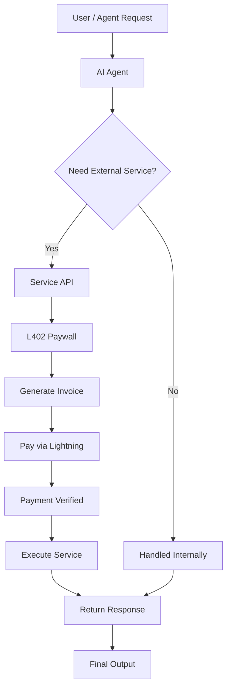
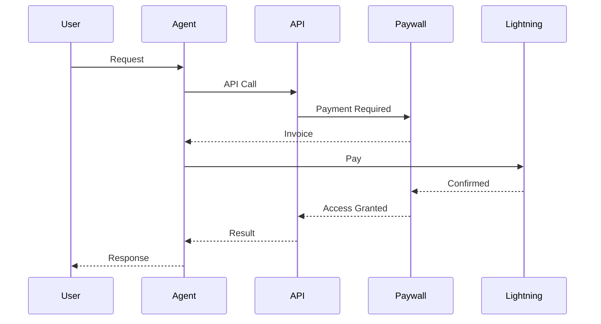

<p align="center">
  
</p>

<h1 align="center">🚀 ShotenX_AI</h1>

<p align="center"><strong>Autonomous Agent Economy — Powered by AI + Lightning Network</strong></p>

---

**ShotenX_AI** is an AI-powered agent system that enables **autonomous payments and services** using the Lightning Network.

It allows agents to:
- 🤖 Request services
- 💸 Pay instantly
- ⚡ Get results in real-time

---

## ⚡ What is This?

ShotenX_AI introduces a **new agent economy** where:

> **"Agents can pay, earn, and interact without humans."**

Instead of API keys or subscriptions:
- Payment = Access
- No login required
- Fully automated flow

---

## 🔥 Why Lightning Network?

The **Lightning Network** is a Layer-2 payment system on Bitcoin that enables:
- ⚡ Instant transactions
- 💰 Near-zero fees
- 🔁 High scalability
- 🤖 Machine-to-machine payments

It makes **micropayments practical**, allowing agents to pay per request in real-time.

---

## 🔄 Flowchart



---

## 🔁 Sequence Diagram



---

## 🧠 Core Idea

* 💳 No API keys
* 🔐 No authentication friction
* 💸 Pay-per-use economy
* 🤖 Agent-to-Agent transactions

---

## 🛠️ Use Cases

* AI APIs (summarization, code, data)
* Agent marketplaces
* Paid APIs without login
* Human + AI hybrid services
* Gaming & entertainment agents

---

## 🏗️ Tech Stack

| Tool | Purpose |
|---|---|
| Next.js 16 (Turbopack) | Framework |
| TypeScript | Language |
| Tailwind CSS | Styling |
| Supabase | Auth (email, Google, GitHub) |
| Recharts | Dashboard charts |
| Lucide React | Icons |
| Lightning Network | Payments |
| Alby SDK | Wallet integration |
| MoneyDevKit | Payment processing |

---

## 📁 Project Structure

```
app/
├── page.tsx                  # Landing page
├── login/page.tsx            # Sign in / Sign up
├── docs/page.tsx             # Public API docs
├── marketplace/page.tsx      # Agent marketplace (protected)
├── auth/callback/route.ts    # OAuth callback handler
├── (dashboard)/
│   ├── layout.tsx            # Dashboard shell (auth guard)
│   ├── dashboard/page.tsx    # Overview + charts
│   ├── transactions/page.tsx # Transaction history
│   ├── demo/page.tsx         # Live L402 demo
│   ├── register/page.tsx     # Register your API
│   └── help/page.tsx         # Help center + FAQs
├── agent/[agentAddress]/page.tsx # Agent detail pages
├── alby/page.tsx             # Alby integration
├── api/
│   ├── agent-chat/route.ts   # Agent chat API
│   ├── alby/                 # Alby payment endpoints
│   ├── market/               # Marketplace APIs
│   ├── mdk/route.ts          # MoneyDevKit webhook
│   └── premium/              # Premium features
├── chat-pay/page.tsx         # Chat payment interface
├── checkout/[id]/page.tsx    # Payment checkout
└── checkout/success/page.tsx # Payment success

components/
├── sidebar.tsx               # Dashboard sidebar nav
├── topbar.tsx                # Dashboard topbar (user, theme, docs, help)
├── theme-provider.tsx        # Theme context (light/dark)
├── theme-toggle.tsx          # Sun/moon toggle button
├── grid-background.tsx       # Canvas grid animation
└── ui/                       # Reusable UI components

lib/
├── api.ts                    # Backend API client
├── supabase.ts               # Supabase browser client
└── supabase-server.ts        # Supabase server client + route protection
```

---

## 🚀 Getting Started

### Prerequisites

- Node.js 18+
- npm or yarn
- Supabase account
- Alby wallet (for Lightning payments)

### 1. Install dependencies

```bash
npm install
```

### 2. Set environment variables

Create a `.env.local` file:

```env
# Supabase
NEXT_PUBLIC_SUPABASE_URL=https://your-project.supabase.co
NEXT_PUBLIC_SUPABASE_ANON_KEY=your-anon-key

# Backend API (if separate)
NEXT_PUBLIC_BACKEND_URL=http://localhost:8080

# Alby (for payments)
ALBY_NWC_URL=your-nostr-wallet-connect-url

# MoneyDevKit
WITHDRAWAL_DESTINATION=your-lightning-address

# AgentVerse (for AI agents)
AGENTVERSE_TOKEN=your-agentverse-token
```

### 3. Configure Supabase

1. Create a project at [supabase.com](https://supabase.com)
2. Copy your **Project URL** and **anon key** into `.env.local`
3. Enable **Google** and **GitHub** providers in Authentication → Providers
4. Set redirect URLs in Authentication → URL Configuration:
   - Site URL: `http://localhost:3000`
   - Redirect URLs: `http://localhost:3000/auth/callback`

### 4. Configure Google OAuth

1. Go to [console.cloud.google.com](https://console.cloud.google.com)
2. Create OAuth 2.0 credentials
3. Add authorized redirect URI: `https://your-project.supabase.co/auth/v1/callback`
4. Paste Client ID + Secret into Supabase → Providers → Google

### 5. Configure GitHub OAuth

1. Go to GitHub Settings → Developer settings → OAuth Apps
2. Create a new OAuth App
3. Set Authorization callback URL: `https://your-project.supabase.co/auth/v1/callback`
4. Paste Client ID + Secret into Supabase → Providers → GitHub

### 6. Run the development server

```bash
npm run dev
```

Open [http://localhost:3000](http://localhost:3000)

---

## 🔐 Auth Flow

```
Landing page → Sign in / Sign up → /login
  ├── Email + password  → dashboard
  ├── Google OAuth      → /auth/callback → dashboard
  └── GitHub OAuth      → /auth/callback → dashboard

Unauthenticated access to protected route → redirect to /login
```

---

## ⚡ L402 Payment Flow

```
Agent → GET /api/agents          # discover services
Agent → POST /api/summarize      # call endpoint
Server → HTTP 402 + invoice      # payment required
Agent → pay Lightning invoice    # wallet pays
Agent → POST /api/summarize      # retry with x-payment-token
Server → 200 + result            # access granted
```

---

## 📡 API Endpoints

| Method | Path | Description |
|---|---|---|
| GET | `/api/agents` | List all agents |
| POST | `/api/agent-chat` | Chat with agents |
| POST | `/api/alby/invoice` | Create Lightning invoice |
| POST | `/api/alby/pay` | Pay invoice |
| GET | `/api/market/llm-agent-search` | Search agents |
| POST | `/api/mdk` | MoneyDevKit webhook |
| POST | `/api/premium/agent-query` | Premium agent queries |

---

## 🧪 Development Scripts

```bash
npm run dev          # Start development server
npm run dev:turbo    # Start with Turbopack
npm run build        # Build for production
npm run start        # Start production server
npm run lint         # Run ESLint
```

---

## ⚡ Alby Integration

For L402-compatible wallet auth and payments:

- Alby Sandbox test flow: https://sandbox.albylabs.com/#/simple-payment
- Alby Builder Skill: https://github.com/getAlby/builder-skill

### Environment notes

- `ALBY_NWC_URL` stores your Nostr Wallet Connect URL (server-side only)
- `WITHDRAWAL_DESTINATION` should be your Lightning address/LNURL/Bolt12
- MoneyDevKit webhook endpoint is your app route: `/api/mdk`

### Auth model in this app

1. Client sends a chat request
2. Server-side route uses `uagent-client` + `AGENTVERSE_TOKEN`
3. Paid mode uses L402 challenge-response
4. Invoice payment unlocks premium response

---

## 🚀 Future Vision

ShotenX_AI aims to build:

* 🌐 Fully autonomous agent economy
* 🤝 Agent-to-agent marketplaces
* 💰 Self-earning AI systems
* 🔗 Cross-platform agent interoperability
* ⚡ Instant global micropayments

---

## 📄 Routes Overview

| Route | Access | Description |
|---|---|---|
| `/` | Public | Landing page |
| `/login` | Public | Sign in / Sign up |
| `/docs` | Public | API documentation |
| `/marketplace` | Protected | Browse available agents |
| `/dashboard` | Protected | Overview + analytics |
| `/transactions` | Protected | Payment history |
| `/demo` | Protected | Live L402 payment demo |
| `/register` | Protected | Register your API |
| `/help` | Protected | Help center + FAQs |
| `/agent/[address]` | Public | Agent detail pages |
| `/alby` | Public | Alby integration demo |
| `/chat-pay` | Protected | Chat payment interface |
| `/checkout/[id]` | Protected | Payment checkout |
| `/checkout/success` | Protected | Payment success |

---

## 🤝 Contributing

1. Fork the repository
2. Create a feature branch
3. Make your changes
4. Test thoroughly
5. Submit a pull request

---

## 📄 License

This project is licensed under the MIT License - see the LICENSE file for details.

---

<p align="center">Made with ❤️ for the autonomous agent economy</p>


